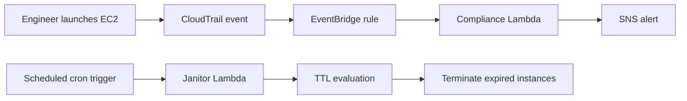
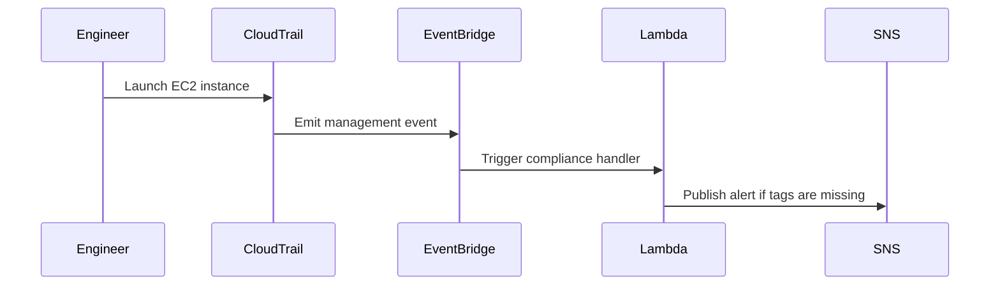

# 🧹 Automated Cloud Janitor & Environment Lifecycle Engine

<div align="center">


</div>

An event-driven AWS governance project that combines FinOps, DevSecOps, and cloud automation into a practical, testable solution. It helps teams enforce tagging rules, identify expired resources by TTL, and notify stakeholders when non-compliant infrastructure is detected.

> Built to reduce cloud waste, tighten security posture, and bring governance closer to developers through automation.

## 🧭 Why this project matters

- Reduce unnecessary AWS spend by automatically cleaning up expired resources
- Improve compliance through mandatory tagging enforcement
- Strengthen cloud security by surfacing drift and misconfigurations quickly
- Provide a reusable foundation for event-driven automation in real-world environments

## 📖 Overview

Cloud environments often accumulate forgotten or over-provisioned resources, causing unnecessary spend and security drift. This project provides a lightweight governance layer that can:

- enforce required tags for EC2 resources
- identify instances that have exceeded their TTL
- publish compliance alerts through SNS
- support deployment through AWS Lambda, CloudFormation, and GitHub Actions

## 🧠 Architecture Overview



### Screenshot-style system view

```text
┌──────────────────────┐        ┌──────────────────────┐
│   EC2 Instance Launch │ ─────> │   AWS CloudTrail      │
└──────────────────────┘        └──────────────────────┘
                                           │
                                           ▼
                                ┌──────────────────────┐
                                │   Amazon EventBridge │
                                └──────────────────────┘
                                           │
                     ┌─────────────────────────┼─────────────────────────┐
                     ▼                         ▼                         ▼
          ┌───────────────────┐      ┌───────────────────┐      ┌───────────────────┐
          │ Compliance Lambda │      │ Janitor Lambda    │      │ SNS Notifications  │
          │   Tag validation  │      │ TTL cleanup       │      │ Alerts & routing  │
          └───────────────────┘      └───────────────────┘      └───────────────────┘
```

## 🔄 Workflow



## ✨ Core Features

1. Real-Time Compliance Checks
   - Evaluates EC2 launch events and flags instances missing required tags such as Owner, Environment, and TTL.
2. TTL-Based Janitor Logic
   - Detects expired instances based on the TTL tag and launch time.
3. AWS-Friendly Automation
   - Includes Lambda handlers, CloudFormation resources, and CI/CD deployment workflow.
4. Test Coverage
   - Includes automated pytest tests for the core compliance and janitor behaviors.

## 🚀 Quick Start

```bash
python -m pip install -r requirements.txt
python -m pytest -q
```

## ☁️ Deployment

## 🛠️ Tech Stack

- Python 3.13
- boto3 for AWS SDK integration
- pytest for automated validation
- GitHub Actions for CI/CD
- AWS Lambda and CloudFormation for deployment

## ☁️ Deployment

1. Create the AWS resources with CloudFormation:

```bash
aws cloudformation deploy \
  --template-file deploy/aws-resources.yaml \
  --stack-name cloud-janitor-stack \
  --capabilities CAPABILITY_IAM
```

2. Add the following GitHub repository secrets:
   - AWS_ACCESS_KEY_ID
   - AWS_SECRET_ACCESS_KEY

3. Push to the main branch to trigger the deployment workflow.

## 📁 Project Structure

```text
Automated-Cloud-Janitor-Environment-Lifecycle-Engine/
├── compliance_checker.py
├── janitor.py
├── tests/
│   └── test_lambda_handlers.py
├── deploy/
│   └── aws-resources.yaml
├── .github/
│   └── workflows/
│       └── deploy.yml
├── requirements.txt
└── README.md
```

## 🧪 Validation

The project includes automated tests for the key behaviors:

```bash
python -m pytest -q
```

## 🔗 Repository

https://github.com/shatteredcode69/Automated-Cloud-Janitor-Environment-Lifecycle-Engine

---

Built with a focus on automation, cloud governance, and practical DevSecOps workflows.